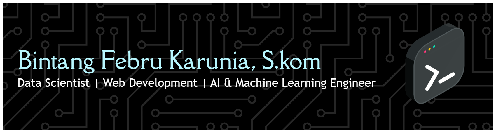

## About Me 
I enjoy turning ideas into real applications and exploring how AI can solve real-world problems.
Most of my projects focus on machine learning, backend systems, and modern web development.
- 🔭 Currently working on personal and academic projects
- 🌱 Learning:
Machine Learning & Deep Learning
Backend Development
Data Analysis & Visualization
- ⚡ Interested in AI, Automation, and Modern Web Technologies

## My Skills
#### Programming Languages

### Frameworks & Libraries

##  Featured Projects
  ## 1. Waste Classification using CNN

AI-based image classification project designed to identify waste categories such as organic, inorganic, and toxic waste using Convolutional Neural Networks.

Highlights :
- Built the project from initial research and dataset preprocessing to deployment
- Developed and trained CNN models for multiclass image classification
- Successfully deployed the application using Flask
- Designed a user-friendly interface for real-time predictio

Click to see the project : https://github.com/Bintangfebru/Waste-Classification-project

## 2. End-to-End Loan Approval Prediction Pipeline

The End-to-End Loan Approval Prediction Pipeline is a machine learning system that predicts loan eligibility using historical customer data. It automates the full workflow from data processing to deployment to improve efficiency, reduce bias, and support faster, more accurate lending decisions.

Click to see the project : https://github.com/Bintangfebru/End-to-End-Loan-Approval-Prediction-Pipeline

## 3. Churn & Customer Predict Analysis Web Base

This project develops a customer churn prediction dashboard that combines exploratory data analysis and machine learning to identify customers likely to discontinue their subscription. The system processes CSV customer data and presents interactive visualizations such as churn trends, risk segmentation, and high-risk customer lists. With a responsive and user-friendly interface, the dashboard helps business teams monitor customer behavior, detect churn patterns, and create data-driven retention strategies.

Click to see the project : https://github.com/Bintangfebru/Churn-Customer-Predict-Analyst-Web-Based

## Career Objective
Seeking opportunities to contribute to impactful projects in Artificial Intelligence, Machine Learning, Backend Development, or Data Science while continuously growing technical expertise and professional experience.

## Connect With Me
Click the Icon

<!-- Instagram -->

<!-- Gmail -->

<!-- LinkedIn -->

<!-- GitHub -->

<!--
**Bintangfebru/bintangfebru** is a ✨ _special_ ✨ repository because its `README.md` (this file) appears on your GitHub profile.

Here are some ideas to get you started:

- 🔭 I’m currently working on ...
- 🌱 I’m currently learning ...
- 👯 I’m looking to collaborate on ...
- 🤔 I’m looking for help with ...
- 💬 Ask me about ...
- 📫 How to reach me: ...
- 😄 Pronouns: ...
- ⚡ Fun fact: ...
-->
